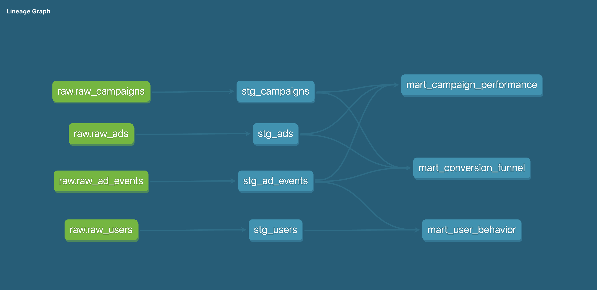
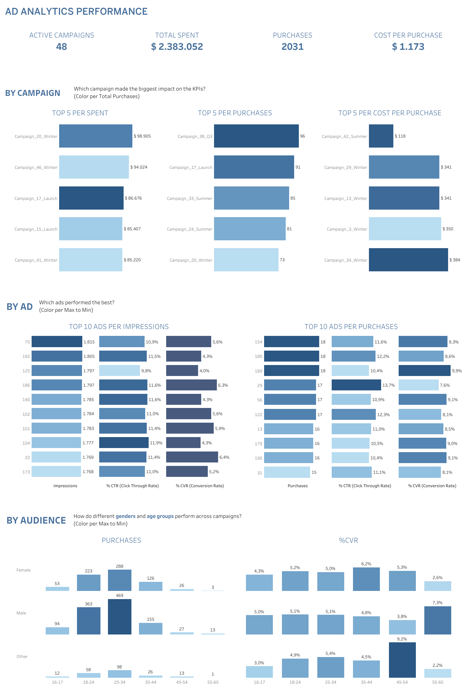

# dbt Ad Analytics

Proyecto de portfolio personal que modela datos de campañas publicitarias en redes sociales
usando dbt + DuckDB. El objetivo es demostrar un flujo completo de ingeniería de datos:
desde la ingesta de datos crudos hasta tablas analíticas listas para visualización en Tableau.

---

## Dataset
- **Fuente:** Kaggle — Social Media Advertisement Performance
- **Link:** https://www.kaggle.com/datasets/alperenmyung/social-media-advertisement-performance
- **Tablas:** Users, Campaigns, Ads, Ad Events
- **Nota:** Dataset sintético que simula plataformas como Facebook e Instagram

---

## Stack
| Herramienta | Uso |
|-------------|-----|
| Python 3.9  | Entorno base |
| dbt-core 1.10 | Transformaciones y modelado |
| dbt-duckdb  | Adaptador local |
| DuckDB      | Base de datos local |
| kagglehub   | Descarga del dataset |
| Tableau     | Visualización |

---

## Arquitectura



El proyecto sigue una arquitectura de tres capas:

- **Raw:** datos crudos cargados desde CSVs a DuckDB vía script Python
- **Staging:** limpieza y estandarización de columnas, una tabla por fuente
- **Marts:** tablas analíticas con métricas de negocio, listas para Tableau

---

## Dashboard

Publicado en Tableau Public: [AD ANALYTICS PERFORMANCE](https://public.tableau.com/app/profile/nicolas.rohland/viz/ADANALYTICSPERFORMANCE/ADANALYTICSPERFORMANCE)



---

## Modelos

### Staging
| Modelo | Descripción |
|--------|-------------|
| `stg_users` | Usuarios limpios y estandarizados |
| `stg_campaigns` | Campañas publicitarias |
| `stg_ads` | Anuncios por campaña |
| `stg_ad_events` | Log de eventos (impresiones, clicks, compras) |

### Marts
| Modelo | Descripción |
|--------|-------------|
| `mart_campaign_performance` | Performance por campaña: budget, CTR, conversion rate, engagement rate |
| `mart_conversion_funnel` | Tasas de conversión por etapa del funnel por campaña |
| `mart_user_behavior` | Compras segmentadas por país, género, edad, intereses y tiempo |

---

## Métricas principales
- **CTR:** clicks / impressions
- **Conversion Rate:** purchases / clicks
- **Engagement Rate:** (likes + shares + comments) / impressions
- **Campaign Status:** identifica campañas con presupuesto pero sin actividad

---

## Calidad de datos
- 36 tests de calidad implementados (not_null, unique, accepted_values)
- `user_id` duplicados en `stg_users` documentados como warning — limitación conocida del dataset sintético
- Campañas sin eventos identificadas con `campaign_status = 'No Events'`

---

## Setup

### 1. Clonar el repo
```bash
git clone https://github.com/nrohland/01_dbt_ad_analytics.git
cd 01_dbt_ad_analytics
```

### 2. Crear entorno virtual
```bash
python3 -m venv venv
source venv/bin/activate
pip install dbt-duckdb kagglehub pandas
```

### 3. Configurar Kaggle API
Obtené tu token desde kaggle.com → Settings → API → Create New Token.
Antes de cada sesión de trabajo corré:
```bash
source .env
```
El archivo `.env` debe contener:

KAGGLE_API_TOKEN="tu_token_aqui"

> ⚠️ El archivo `.env` está excluido de Git.

### 4. Cargar datos
```bash
python3 scripts/load_raw_data.py
```

### 5. Configurar profiles.yml
Crear `~/.dbt/profiles.yml` con:
```yaml
ad_analytics:
  target: dev
  outputs:
    dev:
      type: duckdb
      path: /ruta/absoluta/a/01_dbt_ad_analytics/dev.duckdb
      threads: 1
```

### 6. Correr el proyecto
```bash
cd ad_analytics
dbt run
dbt test
```

### 7. Ver documentación
```bash
dbt docs generate
dbt docs serve
```